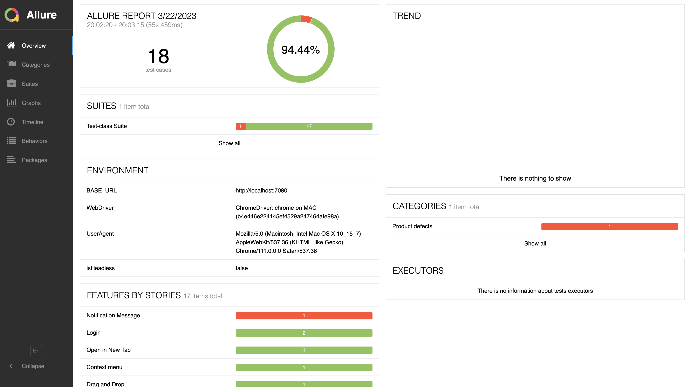

# Test automation

**Design Pattern:** Page Object Model with loadable components(POC)

**Following tools were used in this framework:**  
Java, Selenide, Maven, Allure Reports, Docker, Jenkins, GitHub

## ABOUT PROJECT
Project made in my spare time to develop my skills in automation testing.  
You don't have to download any WebDrivers - I'm using WebDriverManager, drivers will be downloaded by gradle.  
Supported tests executors:
- *Chrome*
- *Firefox*
- *Opera*
- *Safari*
- *Edge*
- *Internet Explorer*

## FEATURES
- Support for Allure Report
- Support for Parallel Testing
- Support for Jenkins
- Support for Docker
- Support for Fake & Mock data
- Support for .yaml files

## HOW TO RUN TESTS
There are multiple ways to run tests from this build. It all depends on what do you want to do:
### TestNG
- Right click on `TestNG.xml` file, and Run ->  This will run all tests attached to specific xml runner
- In terminal type `mvn clean test` -> This will run all tests from tests package.`(src/test/java/tests)`
  _**The default browser Chrome. Activated `Configuration.headless = true` (disabled graphical display of the browser)**_

## TEST RESULTS AND TEST PROTOCOLS
### CI/CD
After each run of the CI/CD cycle, test results will be automatically uploaded to
the environment where the tests were run (Docker)
### Localhost
After each run of a LOCAL loop, two types of log information are stored inside the repository along with test results.
### TestNG
- Allure HTML report in allure-results directory.

In a terminal, type `allure generate --clean` to generate Allure test results.
*Allure test results are available for running tests via: Terminal `mvn clean test` or TestMethod with annotation @Test (src/test/java/tests)*

| FAIL MESSAGE                                      | PASS MESSAGE                                    |
|---------------------------------------------------|-------------------------------------------------|
|  |  |
***
